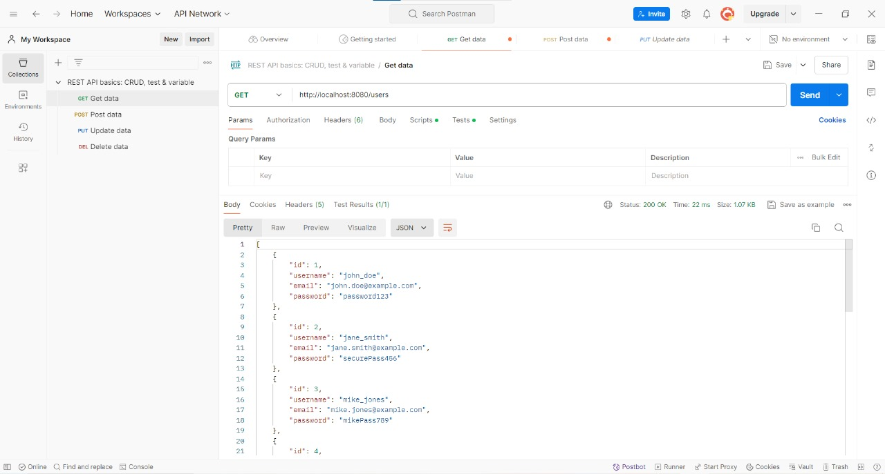
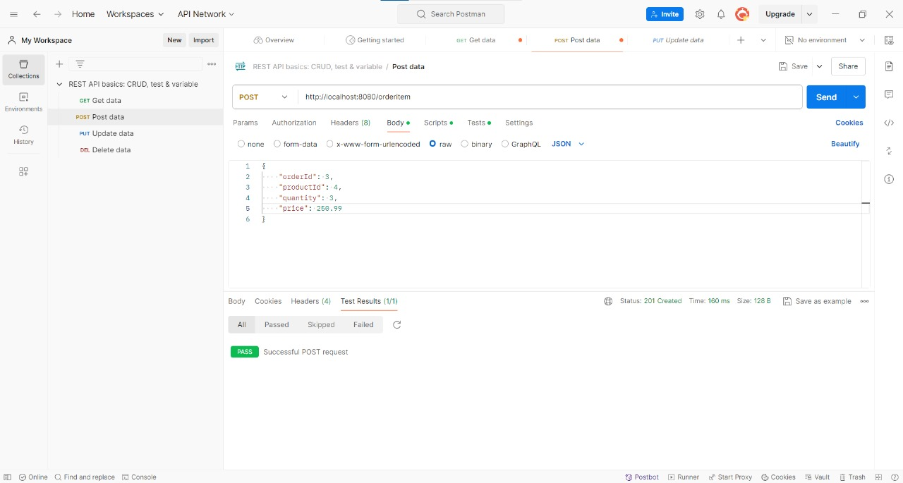

# API REST con Java y Spring Boot

## Descripción

Este es un proyecto básico que utilicé para poner en practica algunos conceptos vistos en la asignatura "Aplicaciones Interactivas" de la facultad. El mismo se basa en la creación de una API REST utilizando Java y Spring Boot, con una base de datos MySQL. Además, se realizaron pruebas de los métodos HTTP con Postman para verificar la funcionalidad de la API.

## Tecnologías

- **Java**: Lenguaje de programación utilizado.
- **Spring Boot**: Framework para el desarrollo de la API REST.
- **MySQL**: Sistema de gestión de bases de datos utilizado.
- **Postman**: Herramienta para probar los métodos HTTP de la API.

## Instalación

### Prerequisitos

- Java JDK 11 o superior
- Maven
- MySQL

### Configuración del Proyecto

1. **Clonar el repositorio:**

    ```bash
    git clone https://github.com/tu-usuario/tu-repositorio.git
    ```

2. **Configurar la base de datos:**

    Revisa de tener MySQL funcionando correctamente. Crea una base de datos con el nombre que queiras. Para esta explicación voy a usar `nombre_base_datos`.

    ```sql
    CREATE DATABASE nombre_base_datos;
    USE nombre_base_datos;
    ```

3. **Configurar el archivo `application.properties`:**

    En `src/main/resources/application.properties`, ajusta la configuración de la base de datos:

    ```properties
    spring.datasource.url=jdbc:mysql://localhost:3306/nombre_base_datos
    spring.datasource.username=tu_usuario
    spring.datasource.password=tu_contraseña
    ```

4. **Ejecuta la aplicación:**

    Navega al directorio del proyecto y ejecuta:

    ```bash
    mvn clean install
    mvn spring-boot:run
    ```

## Uso

La API REST está disponible en `http://localhost:8080`. Acá hay algunos ejemplos de endpoints disponibles:

- **GET** `/products` - Obtiene todos los productos disponibles.
- **GET** `/users/{id}` - Obtiene el usuario que tenga el id recibido por parámetro.
- **POST** `/product` - Crea un nuevo producto.
- **PUT** `/order/{id}` - Actualiza la orden que tenga ese id (en caso de existir) con el body (DTO) que le pasamos por parámetro.
- **DELETE** `/products/{id}` - Elimina el producto con el id correspondiente.

## Pruebas con Postman

Para probar la API, utilicé Postman. Acá están algunas capturas de pantalla de las pruebas realizadas:

### Ejemplo de prueba GET



### Ejemplo de prueba POST


